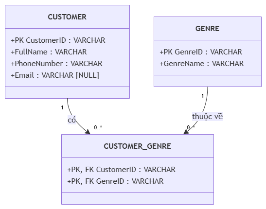

# BÁO CÁO CHUẨN HÓA DỮ LIỆU KHÁCH HÀNG (1NF) - RIKKEI CINEMA

## Phần 1: Phân tích vi phạm dạng chuẩn 1NF (First Normal Form)

- **`FavoriteGenres` vi phạm do là thuộc tính đa trị (Multi-valued):** Một hội viên có thể thích nhiều thể loại phim, việc lưu chung chuỗi danh sách các thể loại vào cùng một ô phân tách bởi dấu phẩy/khoảng trắng phá vỡ tính nguyên tử của dữ liệu.  
  *Hệ quả tiêu biểu:* Gây sai lệch nghiêm trọng khi tìm kiếm/thống kê qua câu lệnh `LIKE '%Action%'` (dễ bắt nhầm dữ liệu, ảnh hưởng bởi lỗi nhập liệu như `Action , , Comedy`), đồng thời không thể đánh chỉ mục (index) và mất tính toàn vẹn dữ liệu.
  
- **`ContactInfo` vi phạm do là thuộc tính phức hợp (Composite):** Thuộc tính này gộp nhiều thông tin độc lập (Số điện thoại và Email) vào chung một cột dữ liệu.  
  *Hệ quả tiêu biểu:* Hệ thống không thể tự động hóa việc lọc danh sách số điện thoại để gửi SMS Marketing hoặc lọc email để gửi Email thông báo tự động; không thể thiết lập ràng buộc `NULL` riêng cho trường Email đối với khách hàng cũ chỉ có số điện thoại.

---

## Phần 2: Giải pháp chuẩn hóa & Mô hình hóa

### 1. Chuẩn hóa thực thể `CUSTOMER`
- Loại bỏ trường phức hợp `ContactInfo`, tách thành 2 cột nguyên tử:
  - `PhoneNumber`: Lưu số điện thoại (bắt buộc - NOT NULL).
  - `Email`: Lưu hòm thư điện tử (cho phép nhận giá trị `NULL` cho hội viên cũ).
- Bỏ trường đa trị `FavoriteGenres` khỏi thực thể `CUSTOMER`.

### 2. Phương án tách `FavoriteGenres` (mô tả bằng lời)
- **Tạo thực thể `GENRE`:** Lưu danh mục thể loại phim chuẩn, gồm khóa chính `GenreID` (PK) và tên thể loại `GenreName`.
- **Tạo bảng trung gian `CUSTOMER_GENRE`:** Giải quyết mối quan hệ nhiều - nhiều (N:N) giữa khách hàng và thể loại. Bảng này gồm 2 khóa ngoại:
  - `CustomerID` (FK tham chiếu tới `CUSTOMER.CustomerID`).
  - `GenreID` (FK tham chiếu tới `GENRE.GenreID`).
  - Khóa chính tổng hợp (Composite Primary Key) là `(CustomerID, GenreID)`.

---

## Phần 3: Vẽ draw.io

